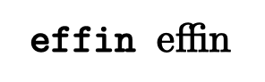

# The .tome file format


# Introduction

My dream is to have a large percentage of the content I want to read
on the web published with an aesthetically pleasing typographical
style in a format that quick to download and render.

In a standard browser I should be able to click on a link to one
of these new-style hypertext documents and it should download
and render quicker than a well-typeset standard html/css/javascript
document.

These documents should also be renderable outside of a standard
web browser. 

This is a discussion of the problems I want solved and a potential
solution that should fit easily in with the current web.

# Motivations

The web — circa 2023 — is optimized for webapps. The public
needs a document-centric hypertext document format that prioritizes
legibility, accessibility, and latency to first complete screen rendering.

This is my quixotic attempt to put forth something better, 
get an official RFC published, 
and get this adopted by the document-centric web.

# Assumptions

* The current web is a cacophyony of bad taste
* Various people advotated for a "small web" have been experiementing with the use of Gopher and Gemini. We should learn from these experiments but we don't believe that a protocol incompatible with the web will further our goals.
* The format should be optimized for latency from the start of the first HTTP GET to being finished drawing the first screenful of text in the intended fonts.
* The read-to-write ratio is potentially very high therefore we should optimize for the reading experience.
* Good typography is important. A blog entry in 2023 should look no worse than a CS research paper from 1988.
* Rendering a document under normal circumstances should be not much more than the following commands for each character: 1. Move the drawing cursor to the next location (relative), 2. Draw the glyph for the current character.
* Given the previous point, under normal circumstances, the client should *not* have to do any fancy layout. It should just follow commands. Layout should have happened beforehand on the server when the document was published.
* We shouldn't optimize for the possibility of super-wide or super-narrow layouts. Normal documents have a width of xxx-xxx characters (Bringhurst) therefore it might make sense to prerender a few common widths in a way in which the author intended and declare defeat for everything else. They will still get the content but it should be throught of more as a stream of characters rather than something properly laid out.
* Plain-text with a fixed-width font should always be a valid document. In fact, the generated form of this style document should be identical to one produced by-hand in a text editor.
* The DVI format is a good starting place to replace HTML for hypertext documents. It's compact, simple, and already very close to the ideal of being able to produce a document with a fixed-width font in a text editor. (See Section 2.2 of https://tug.org/pracjourn/2007-1/cho/cho.pdf for how to create a DVI document from scratch)
* Improvements to DVI would be: native UTF-8, hyperlinks (I think people currently use "specials" for this), no need for preamble or postable for plain-text documents, always include the unicode code points even if referring to different glyphs and other semantic improvements needed for accessibility)
* The standard fonts should be standard and distributed to everyone. We don't want to display different fonts to different people because their OS vendor chose to buy fonts from a particular foundary.
* TeX's standard fonts are a good default, though maybe using the ones optimized for screens rather than printing. The unifont is a good fallback for the rest of the unicode glyphs.
* It's not entirely clear in my head whether navigation controls around the document or website should be provided by the docuemnt or the reader.
* Dark-mode/light-mode is here to stay and should be configurable on every document.
* It should be dead-simple to write a reader that ignores formatting and just wants to render plain text. It could be as simple as ignoring every byte below 32.
* Given that we want the latency to first page displayed to be low as possible, for non-standard fonts maybe we should encode a 32x64 (or something) bitmap version of the characters used on that first page along with those characters

# Open Questions

* What should the default unit be? TeX and DVI have special units. In the web we use pixel-like units that are 2x or 3x the size of the actual pixels sometimes. Should we use the web units?
* What size should the inline bitmap fonts be?

# Proposal

* A plain-text UTF-8 document is valid and should be rendered as is with MLModern-typewriter with word-wrapping being client-configurable (given this is a monospaced font clients should also make it easy to swap out with your desired monospaced font) 
* A byte with value 32-127 is drawn as the current font and the cursor is moved to the right by the glyph width, RTL languages have negative widths so this works the same way).
* Use the first 31 characters (excluding null) of ASCII (and UTF-8) as the control characters they were intended to be. 
* Numbers used as parameters for commands are encoded as variable width integer (either [LEB128](https://en.wikipedia.org/wiki/LEB128) or [PrefixVarint](https://chromium.googlesource.com/chromiumos/third_party/libtextclassifier/+/adbbad2e0138453af45cc08cb3d04317ae2b8ba1/utils/base/prefixvarint.h) or [SQLite Varint](https://sqlite.org/src4/doc/trunk/www/varint.wiki))
* The control character 01 means read a signed variable width number from the input and move to the right that number of units.
* The control character 02 means read a signed variable width number from the input and move down that number of units.
* The control character 09 means move to the right a default amount (we need to figure out what to set the default to)
* The control character 13 means move relative down and absolute left a configured amount.

## Example 1

```latex
\tt effin
\rm effin
\bye
```



```
11 80 80 cc 00                                                              R 1245184 (right)
12 80 80 88 01                                                              D 2228224 (down)
13 fb 00 2e 40 1a c5 80 80 28 80 80 28 00 0a 72 6d 2d 6d 6c 6d 74 74 31 30  L 123 0x2e401ac5 655360 655360 0 10 rm-mlmtt10
14 fb 00                                                                    F 123 (set current font)
65 66 66 69 6e                                                              "effin"
11 ff ff 14 20                                                              R 344063 " "
13 e0 00 77 08 73 82 80 80 28 80 80 28 00 09 72 6d 2d 6d 6c 6d 72 31 30     L 96 0x77087382 655360 655360 0 9 "rm-mlmr10"
14 e0 00                                                                    F 96 (set current font)
65                                                                          "e"
15 0e 03 66 66 69                                                           "ffi" ligature using glyph 0e
6e                                                                          "n"
```

# References

### Original ASCII Control Character Semantics

- 01 Start of Heading
- 02 Start of Text
- 03 End of Text
- 04 End of Transmission
- 05 Enquiry
- 06 Acknowledgement
- 07 Bell
- 08 Backspace
- 09 Horizontal Tab
- 10 Line Feed
- 11 Vertical Tab
- 12 Form Feed
- 13 Carriage Return
- 14 Shift Out
- 15 Shift In
- 16 Data Link Escape
- 17 Device Control 1 (often XON)
- 18 Device Control 2
- 19 Device Control 3 (often XOFF)
- 20 Device Control 4
- 21 Negative Acknowledgement
- 22 Synchronous Idle
- 23 End of Transmission Block
- 24 Cancel
- 25 End of Medium
- 26 Substitute
- 27 Escape
- 28 File Separator
- 29 Group Separator
- 30 Record Separator
- 31 Unit Separator

### DVI Opcodes

From [The DVI File Format](https://web.archive.org/web/20070403030353/http://www.math.umd.edu/~asnowden/comp-cont/dvi.html)

- Opcodes 0-127: set_char_i (0 <= i <= 127)
- Opcodes 128-131: seti (1 <= i <= 4); c[i]
- Opcode 132: set_rule; a[4], b[4]
- Opcodes 133-136: puti (1 <= i <= 4); c[i]
- Opcode 137: put_rule; a[4], b[4]
- Opcode 138: nop
- Opcode 139: bop; c_0[4]..c_9[4], p[4]
- Opcode 140: eop
- Opcode 141: push
- Opcode 142: pop
- Opcodes 143-146: righti (1 <= i <= 4); b[i]
- Opcodes 147-151: wi (0 <= i <= 4); b[i]
- Opcodes 152-156: xi (0 <= i <= 4); b[i]
- Opcodes 157-160: downi (1 <= i <= 4); a[i]
- Opcodes 161-165: yi (0 <= i <= 4); a[i]
- Opcodes 166-170: zi (0 <= i <= 4); a[i]
- Opcodes 171-234: fnt_num_i (0 <= i <= 63)
- Opcodes 235-238: fnti (1 <= i <= 4); k[i]
- Opcodes 239-242: xxxi (1 <= i <= 4); k[i], x[k]
- Opcodes 243-246: fnt_defi (1 <= i <= 4); k[i], c[4], s[4], d[4], a[1], l[1], n[a+l]
- Opcodes 247: pre; i[1], num[4], den[4], mag[4], k[1], x[k]
- Opcodes 248: post; p[4], num[4], den[4], mag[4], l[4], u[4], s[2], t[2]; < font definitions >
- Opcodes 249: post_post; q[4], i[1]; 223's
